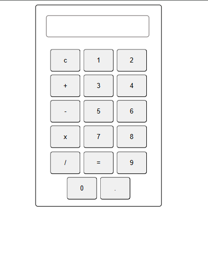

# simple-calculator
🔢 Simple Calculator
This is a basic calculator web app built using HTML, CSS, and JavaScript. It performs standard arithmetic operations like addition, subtraction, multiplication, and division. This is my first minor project using JavaScript, created as part of my learning journey.

💡 Features
Perform basic arithmetic: +, −, ×, and ÷

Clean and simple user interface

Responsive design 

Keyboard  inputs 

🛠️ Tech Stack
HTML – Structure of the calculator

CSS – Styling and layout

JavaScript – Logic for operations and user interaction

📸 Screenshot

🚀 Getting Started
To run this project locally:

Clone the repository:

bash
Copy
Edit
git clone https://github.com/anurag-thakur-2007/simple-calculator.git
Open index.html in your browser.

No additional setup required!

🌐 Live Demo
You can try it here:
🔗 Live Demo <!-- Replace # with your GitHub Pages link -->

📚 What I Learned
Basics of JavaScript functions, DOM manipulation, and event listeners

Creating interactive UI elements using HTML & CSS

Handling user input and basic validation

📌 Future Improvements ( which i will add soon )
Add a backspace button

Enable keyboard support

Implement dark/light theme toggle

📄 License
This project is open-source and available under the MIT License.